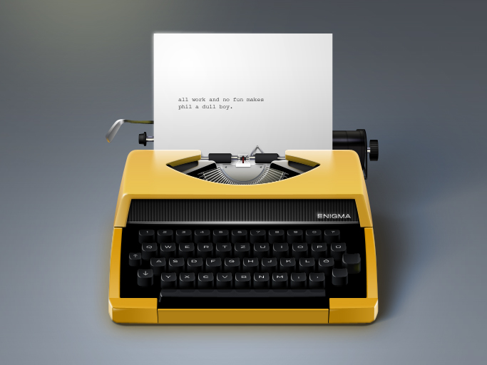

# What is it ?

It's cool to play typewriter sound in Vim when you are typing a letter. :sunglasses:



:zap: You can use it along with the [typewriter color scheme](https://github.com/logico-dev/typewriter), and feel like you are really working on a typewriter. 

Enjoy the rhythm of your code, gain the power from the sound, become productive in vim. :wine_glass:


# Installation

## vim-plug

```VimL
Plug 'skywind3000/vim-keysound'
```

## vundle

```VimL
Plugin `skywind3000/vim-keysound`
```

# Configuration

Enable keysound from start:

```VimL
let g:keysound_enable = 1
```

Command `:KeysoundEnable` and `:KeysoundDisable` can be used to manually start/stop the plugin if `g:keysound_enable` is not assigned.

Choose a sound theme:

```VimL
let g:keysound_theme = 'default'
```

Then the plugin will work and you can enjoy sound effect when you are typing in insert mode.

Avaliable themes are: **`default`**, **`typewriter`** and **`mario`**. Additional sound themes can be found in `sounds` directory in your `runtimepath`, that is your `~/.vim/sounds` or `/path-to-your-dotfiles/sounds`.

Change python version:

```VimL
let g:keysound_py_version = 3
```

Both 2 and 3 are available. It is assigned to zero by default, and will choose python automatically, change it to 2 or 3 if you need specify the python version.

# Function

keysound provide a function to allow you play any wav file in vim.

```VimL
keysound#playsound(wavfile, volume)
```

`wavfile` is the path of your `.wav` file, `volume` is an integer with range of 0-1000.

## Requirements

- Python or Python3 integration in vim
- [PySDL2](https://github.com/marcusva/py-sdl2) with SDL2 binaries.

PySDL2 is used to provide low-latency audio playback.

### Ubuntu

Just install `python-sdl2` or `python3-sdl2` with `apt-get`, depend on your python version in vim:

```bash
apt-get install python-sdl2
```

or 

```bash
apt-get install python3-sdl2
```

### Windows

Install pysdl2 in python or python3:

```batch
pip install pysdl2
```

or 

```batch
pip3 install pysdl2
```

Download `SDL2.dll` from [here](https://www.libsdl.org/download-2.0.php), `SDL2_mixer.dll` from [here](https://www.libsdl.org/projects/SDL_mixer/). Put the two files into your python's installation directory. 

You can verify your SDL2 installation by `python -c "import sdl2"`. If there is no exceptions, your installation is fine.

### Mac OS X

Install pysdl2 and sdl2 shared librarys by brew.


# About

TODO